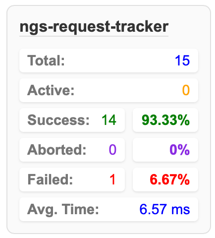

# ngs-request-tracker

`ngs-request-tracker` is a library for tracking (requestTrackerInterceptor), storing (RequestTrackerService) and displaying statistics (RequestTrackerComponent) on all http requests.



### Navigation

- [Installation & Usage](#installation--usage)
1. **[Track 'is loading'](#track-is-loading)**: - for managing loaders or spinners in the UI during ongoing network operations.
2. **[Track all requests stats](#track-all-requests-stats)** - UI component for displaying statistics.
- [Contributing](#contributing)

---

## Installation & Usage

Install `ngs-request-tracker` via npm:

```bash
npm install ngs-request-tracker
```

---

### Track 'is loading'

app.config.ts:
```typescript
export const appConfig: ApplicationConfig = {
  providers: [
    provideHttpClient(withInterceptors([requestTrackerInterceptor])) //add requestTrackerInterceptor interceptor
  ]
};
```

your.component.ts:
```typescript
@Component({
  selector: 'app-your',
  template: `
    <div *ngIf="requestTracker.isInProgress()">Loading...</div>
    <div *ngIf="requestTracker.isInProgress$ | async">Loading...</div>
  `,
  imports: [AsyncPipe]
})
export class YourComponent {
  constructor(public requestTracker: RequestTrackerService) {}
}
```

---

### Track all requests stats


app.config.ts:
```typescript
export const appConfig: ApplicationConfig = {
  providers: [
    provideHttpClient(withInterceptors([requestTrackerInterceptor])) //add requestTrackerInterceptor interceptor
  ]
};
```

your.component.ts:
```typescript
@Component({
  selector: 'app-your',
  standalone: true,
  imports: [RequestTrackerComponent],
  template: `
    @if (isDevMode) {
        <ngs-request-tracker
        [xPosition]="'right'" 
        [yPosition]="'bottom'"
      ></ngs-request-tracker>
    }
  `,
  styleUrl: './app.component.scss',
})
export class YourComponent {
  isDevMode = isDevMode(); // use as desired
}
```

---

## Contributing

To contribute or use the library in development mode, you can clone the repository and install dependencies.

### Steps to contribute:

1. Fork the repository
2. Clone the repo, install dependencies

```bash
git clone https://github.com/andrei-shpileuski/ngs-request-tracker.git
```

```bash
cd ngs-request-tracker
```

```bash
npm install
```

3. Create a new branch for your changes
4. Submit a pull request with a detailed description of the changes
